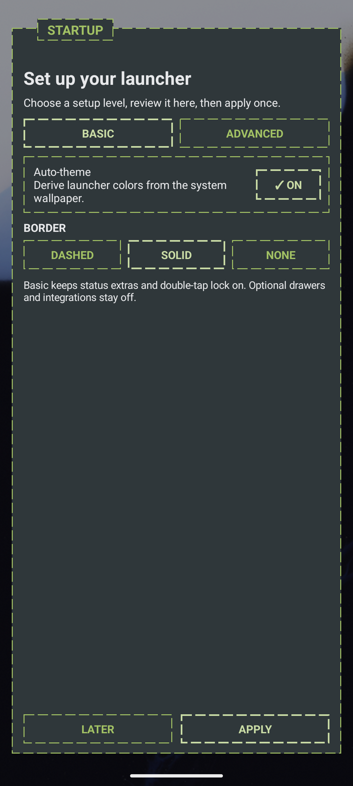
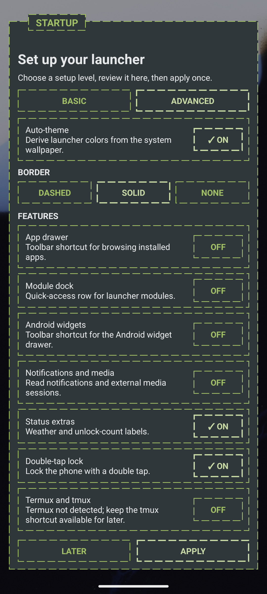
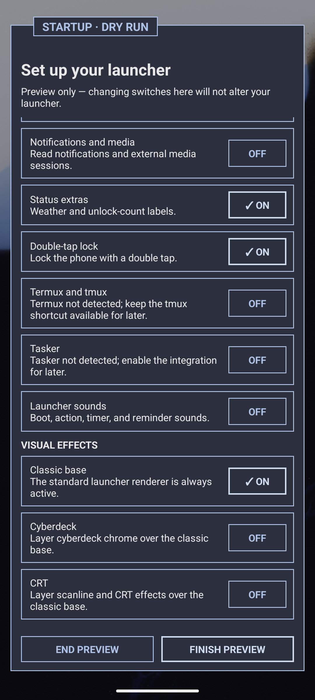
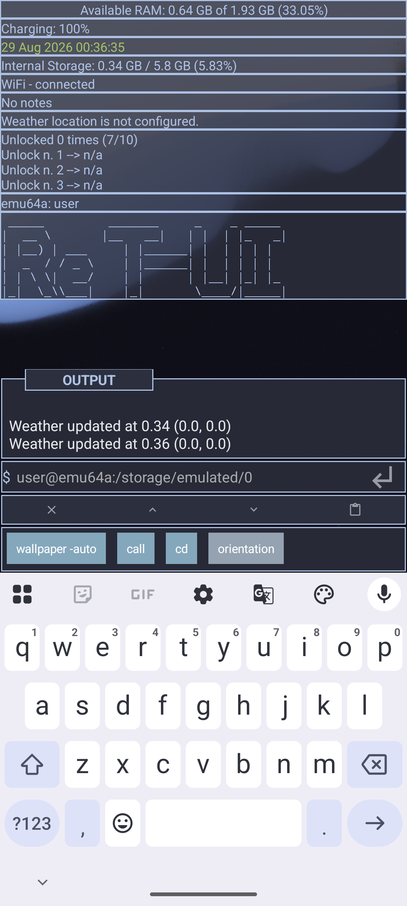

# Getting Started with Re:TUI

This guide covers the one-page startup setup shown on a new installation. It
matches startup menu version 3 and was verified on an Android emulator on
2026-08-29.

## First launch

Re:TUI opens the startup pane automatically on its first launch. All choices
stay staged until you select **Apply**.

1. Choose **Basic** or **Advanced**.
2. Decide whether to keep **Auto-theme** on.
3. Choose **Dashed**, **Solid**, or **None** for launcher borders.
4. If you selected Advanced, review the feature and visual-effect switches.
5. Select **Apply** once to save the setup and open the launcher.

Select **Later** to close the pane without changing launcher settings. The
startup pane will return on the next launch.



## Basic setup

Basic is the shortest setup path. Its defaults are:

- **Auto-theme:** On
- **Border:** Solid
- **Status extras:** On
- **Double-tap lock:** On
- Optional drawers, modules, integrations, notifications, and sounds: Off
- Cyberdeck and CRT effects: Off

With Auto-theme on, Re:TUI uses the system wallpaper, derives launcher colors
from it, and keeps the wallpaper overlay transparent.

The border choices are:

- **Dashed:** borders use the normal 4 dp gap.
- **Solid:** borders stay enabled with no gap.
- **None:** generated launcher borders are disabled.

## Advanced setup

Advanced includes the same Auto-theme and border choices, followed by these
independent switches:

| Choice | Default | What it enables |
| --- | --- | --- |
| App drawer | Off | Installed-app browsing shortcut |
| Module dock | Off | Quick-access row for launcher modules |
| Android widgets | Off | Android widget-drawer shortcut |
| Notifications and media | Off | Notifications and external media sessions |
| Status extras | On | Weather and unlock-count labels |
| Double-tap lock | On | Double-tap gesture for locking the phone |
| Termux and tmux | Off | tmux workspace shortcut |
| Tasker | Off | Re:TUI actions and Tasker tasks |
| Launcher sounds | Off | Boot, action, timer, and reminder sounds |

The menu reports whether Termux and Tasker are detected, but enabling a switch
does not install either app or grant its permissions.



### Visual effects

The Classic renderer is always the base. **Cyberdeck** and **CRT** are separate
effects: either one, both, or neither can be enabled.



## After applying

Re:TUI closes the startup pane, refreshes the existing launcher, and preserves
the command session. If Termux or Tasker was enabled, follow the setup message
shown in the output pane.



Every startup choice can be changed later through the Settings Hub. Startup
does not choose between Classic and Search launcher modes.

## Preview the startup pane again

To review or demonstrate startup without changing the current configuration,
run:

```text
guide -startup-test
```

The pane is labelled **STARTUP · DRY RUN**. Select **End Preview** or **Finish
Preview** when done; neither action applies the previewed choices.

## Troubleshooting

- **The startup pane did not appear after reinstalling:** Android may have
  restored the app's completed-startup state from backup. Use
  `guide -startup-test` to inspect the flow without erasing your configuration.
- **You selected Later:** close and reopen Re:TUI; startup remains pending until
  Apply is selected.
- **Termux or Tasker says “not detected”:** install the app first, then finish
  its own access or bridge setup after Re:TUI starts.
